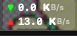
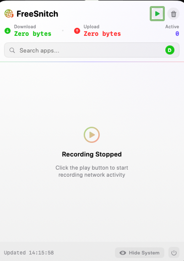
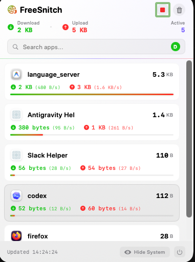

# Vibe-coding niche Mac apps
I use a Mac M-series Air as my daily driver and appreciate the number of great apps available for free.

But there are also some apps that I either can’t afford or that don’t exist yet. So I tried vibe-coding similar apps in Swift and SwiftUI using Antigravity, and it turned out pretty great. I have no experience in native development.

I had already installed Xcode for basic iOS app development using React Native, so Antigravity was able to get to work immediately.

I wanted an app that could monitor how much data my Mac was consuming since I am on a mobile data plan. I also wanted to view a list of apps that were consuming bandwidth in real time.

Little Snitch provided these features, but the free trial was over and it kept asking me to buy a license. Activity Monitor was too slow, and CLI tools were not easy to glance at quickly.

So I prompted Antigravity with Gemini 3.1 Pro to build an app with the controls I wanted. I asked it to use only Swift and SwiftUI so that the app size would stay pretty light.

After a few iterations, and without writing any code myself, I got what I wanted. I set it to start at login so that I can quickly check whether something is eating up my data.

I can also track which apps are consuming bandwidth, sort and search the list, and start or stop recording bandwidth consumption. It uses commands under the hood and pipes the output to the UI.

It also generated an icon using Nano Banana and loaded it into the app.

I built a few other apps as well, which use the private APIs of certain services I use, so that I can glance at them from the menu bar. Now I have my little garden of mini apps!

The apps are pretty light and do the job well.

I searched for commercial offerings that let users vibe-code Mac apps for their own use cases, and it looks like Raycast is building something in this space with [Glaze](https://www.glaze.app). It includes a lot of integrations, a store, and more.

*This post was written by hand and then edited by AI.*

# screenshots

*Menu Bar monitor*

*Application UI with no record active*

*Recorded activity details*

[← Back to Home](../../README.md)
